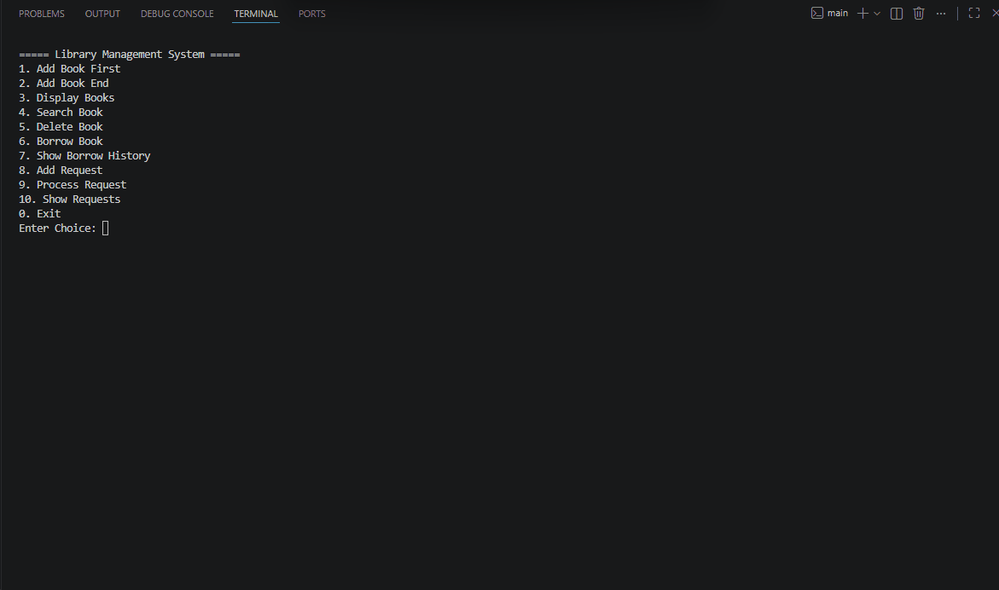

# Library Management System (C++ Data Structure Project)

## Project Description

This project is a simple Library Management System developed using C++.

The project demonstrates the use of:

- Linked List
- Stack
- Queue


---

# Features

## Linked List
- Add book at first
- Add book at end
- Search book
- Delete book
- Display all books

## Stack
- Store borrow history

## Queue
- Manage borrow requests

---

# Project Structure

```txt
LibrarySystem/
│
├── public/
│   └── demo.mp4
│
├── LibrarySystem.h
├── LibrarySystem.cpp
├── main.cpp
└── README.md
```

---

## Build and Run 
- build Run : g++ main.cpp LibrarySystem.cpp -o main 
- Run : ./main

---
# Project Demo

[](public/demo.gif)